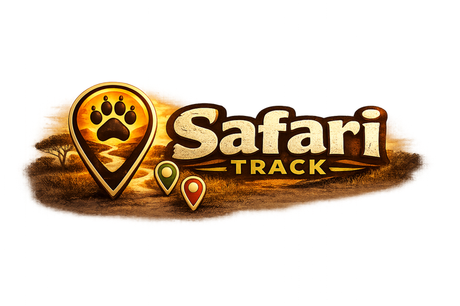
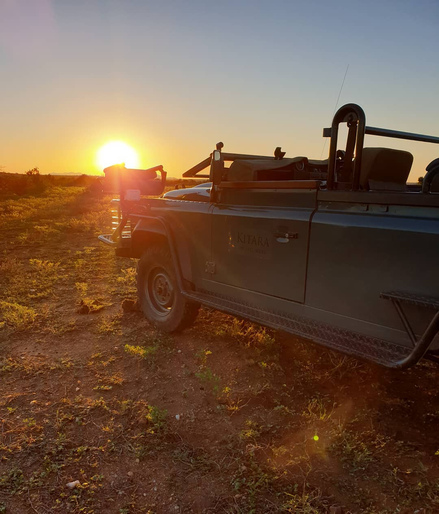
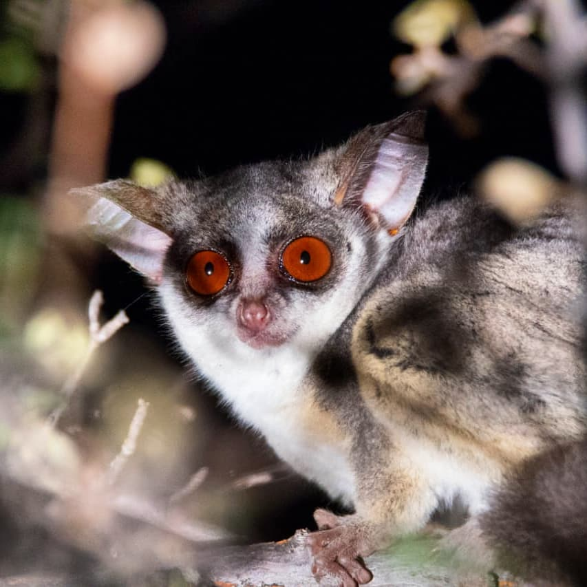
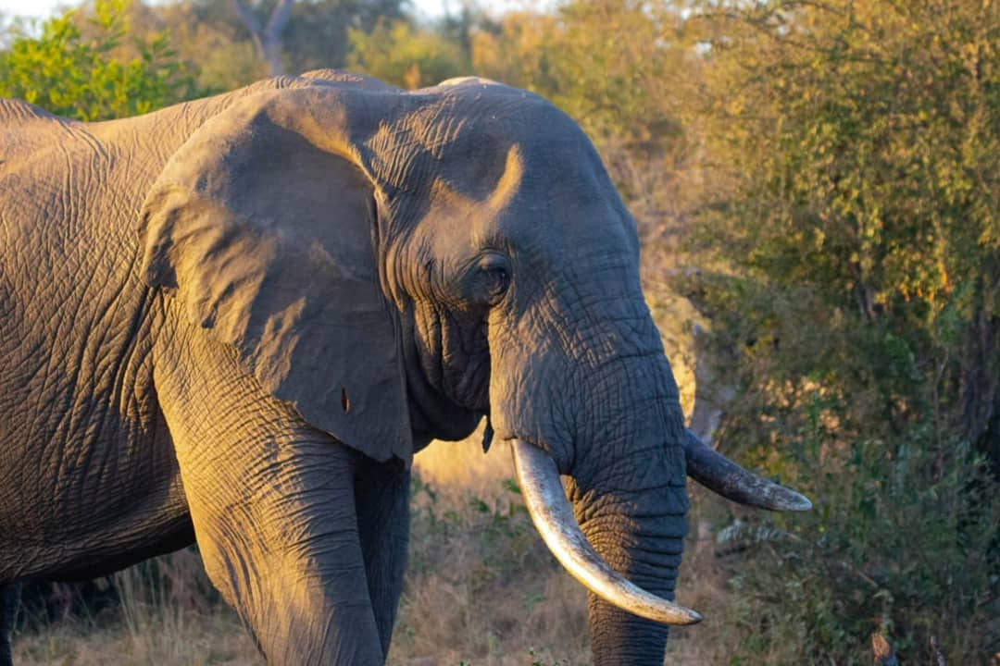
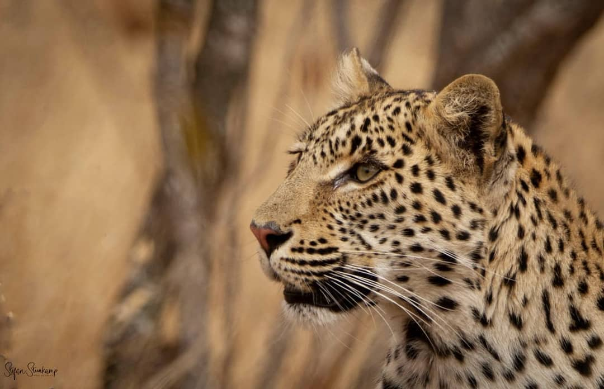
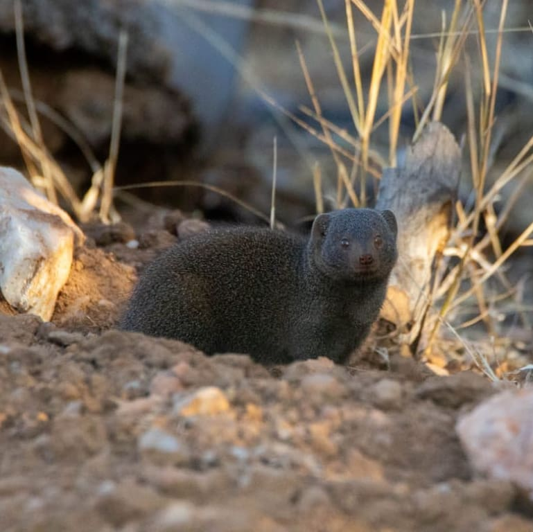

<p align="center">
  
</p>

<h1 align="center">Safari Track</h1>

<p align="center">
  <strong>GPS-tracked game drives and wildlife sighting logs for safari lodges</strong>
</p>

<p align="center">
  
  
  
  
</p>

---

## For the Business Owner

**Safari Track is a mobile app that your game guides carry on every drive.** It records their GPS route in real time, lets them tap to log every animal they spot, and builds a personal wildlife checklist for each guide. When the drive is over, guests and lodge managers can review a beautiful map of the route with every sighting pinned to the exact location. Everything works offline in the bush and syncs automatically when back in Wi-Fi range. Think of it as Strava for safari guides — but instead of tracking fitness, it tracks wildlife encounters across your lodge.

---

<p align="center">
  
</p>

## What It Does

### Game Drive Recording


- **Live GPS tracking** with route recorded every 10 seconds
- **Speed-coloured route line** (green = slow, red = fast) like Strava
- **Direction arrow** showing which way the vehicle is heading
- **Auto-pause** when the vehicle stops, auto-resume when it moves
- **Compass** with N/E/S/W labels for navigation in the field
- **Drive timer, distance, and sighting counter** always visible
- Works completely **offline** — syncs when back in range

<br clear="both" />

### Wildlife Sighting Logger


- **Tap to log** a sighting instantly during a drive
- **240+ species** across Mammals, Birds, Reptiles, and Creepy Crawlies
- Log count, notes, and **"Heard only"** for sounds without visuals
- **Decrement with confirmation** to prevent accidental removal
- Each sighting pinned to GPS location on the map
- Species images and category indicators

<br clear="both" />

### Personal Species Checklist


- **Progress tracking** with percentage complete and per-category breakdowns
- Auto-updates as sightings are logged
- Filter by **category, search, or spotted-only**
- Adjustable **thumbnail sizes** (S / M / L / XL)
- **Guest browsable** — visitors can explore without signing in
- First sighting date and location recorded for each species

<br clear="both" />

### Interactive Map


- **Satellite, terrain, and street** map layers
- **Road overlay** uploaded by the lodge admin
- **Points of Interest** — tap the pin button, tap the map, name it
- Sighting markers, photo markers, and position dot with bearing arrow
- **Route overview** with fit-to-bounds and bottom panel awareness
- **Flythrough mode** replays the drive with photos on a timeline

<br clear="both" />

### Drive History & Review
- Browse all drives with sighting counts and status
- **Multi-select and bulk delete** drives
- Full route playback with sightings, photos, and statistics
- Duration, distance, average speed, max speed
- Admin users can delete any drive

### Multi-Drive Trips
- Group consecutive drives into a **trip**
- Species carry forward across drives in the same trip
- Trip summary shows aggregated sightings for the day

### Strava Integration
- **Connect your Strava account** via OAuth
- Browse and **import Strava activities** as drives (route + photos)
- **GPX import** from any GPS device

### Lodge Showcase
- Beautiful **lodge pages** with hero images and branding
- Three lodges in the Greater Kruger: Nzumba, Last Word Kitara, Dundee
- Each lodge has its own colour scheme and logo

### Offline-First PWA
- **Install to home screen** on iOS and Android
- Full functionality without internet — drives, sightings, checklist all work offline
- **Background sync** queues mutations and drains when online
- **Lock screen notifications** showing drive time and distance
- Species images pre-cached for offline browsing
- Session caching for instant app startup

### Admin Tools
- **Species management** — add, edit, delete species
- **Road data upload** — GeoJSON road network overlay on map
- **Strava credentials** — configure OAuth client for the lodge

---

<p align="center">
  
</p>

## Tech Stack

| Layer | Technology |
|-------|-----------|
| **Framework** | Next.js 15 (App Router, Turbopack) |
| **Language** | TypeScript (strict mode) |
| **Styling** | Tailwind CSS 4 |
| **API** | tRPC 11 (end-to-end type safety) |
| **Database** | MongoDB Atlas via Prisma ORM |
| **Auth** | NextAuth 5 (credentials, bcrypt, JWT) |
| **Maps** | Leaflet (OpenStreetMap + Esri satellite) |
| **Offline** | Service Worker (Serwist) + IndexedDB |
| **Package Manager** | pnpm |
| **Deployment** | Fly.io (Johannesburg region) |

## Data Models

| Model | Purpose |
|-------|---------|
| **User** | Guide account with role (ADMIN/GUIDE/VIEWER) and lodge |
| **Lodge** | Safari camp with GPS coordinates and branding |
| **Species** | Wildlife catalogue — 243+ species with images |
| **DriveSession** | Game drive with GPS route, photos, and timestamps |
| **Sighting** | Wildlife observation linked to drive, species, and location |
| **ChecklistItem** | Per-user species tracking with sighting history |
| **PointOfInterest** | Named map markers with category and icon |
| **StravaAccount** | OAuth tokens for Strava integration |
| **AppSettings** | Key-value config (Strava credentials, etc.) |

## Getting Started

### Prerequisites

- **Node.js** >= 22
- **pnpm** (`corepack enable && corepack prepare pnpm@latest --activate`)
- **MongoDB Atlas** cluster (or MongoDB 6+)

### Environment Setup

```bash
cp .env.example .env
```

Edit `.env`:

```env
AUTH_SECRET="<generate with: npx auth secret>"
DATABASE_URL="mongodb+srv://<user>:<password>@<cluster>.mongodb.net/<database>?retryWrites=true&w=majority"
```

### Quick Start

```bash
./run-dev.sh        # macOS / Linux
.\run-dev.ps1       # Windows PowerShell
run-dev.bat          # Windows Command Prompt
```

Or manually:

```bash
pnpm install
pnpm db:push          # push schema to MongoDB
pnpm db:seed          # seed species + default admin
pnpm dev              # start at http://localhost:3003
```

### Default Admin

- **Email:** `admin@klaserie.co.za`
- **Password:** `admin123`

The seed creates 3 lodges, 243+ species, and 1 admin user.

## Available Scripts

| Script | Description |
|--------|-------------|
| `pnpm dev` | Dev server with Turbopack |
| `pnpm build` | Production build |
| `pnpm start` | Production server |
| `pnpm typecheck` | TypeScript type checker |
| `pnpm db:push` | Push Prisma schema to MongoDB |
| `pnpm db:seed` | Seed species and admin user |
| `pnpm db:studio` | Prisma Studio (database GUI) |

## Project Structure

```
src/
  app/
    _components/          # Shared components (map, GPS, sighting panel, nav)
    admin/                # Admin pages (species, roads, settings)
    api/                  # API routes (auth, tRPC, GPX upload, roads upload)
    auth/signin/          # Sign-in page
    changelog/            # What's New page
    checklist/            # Species checklist
    drive/                # Active drive recording
    drives/               # Drive history + detail + GPX import
    lodges/               # Lodge showcase pages
    profile/              # User profile and settings
    strava/               # Strava connection and activity import
  lib/                    # Utilities (offline queue, sync, notifications, stores)
  server/
    api/routers/          # tRPC routers (drive, sighting, species, poi, etc.)
    auth/                 # NextAuth config
  styles/                 # Tailwind theme
prisma/
  schema.prisma           # 9 data models
  seed.ts                 # 243+ species, 3 lodges, admin user
```

## Lodges

All three camps are in the north-west sector of the Greater Kruger:

| Lodge | Latitude | Longitude |
|-------|----------|-----------|
| Nzumba Camp | -24.1925 | 31.0742 |
| Last Word Kitara | -24.2048 | 31.0831 |
| Dundee Camp | -24.1812 | 31.0654 |

---

<p align="center">
  
</p>

<p align="center">
  <em>Built for the guides, guests, and wildlife of the Greater Kruger.</em>
</p>
